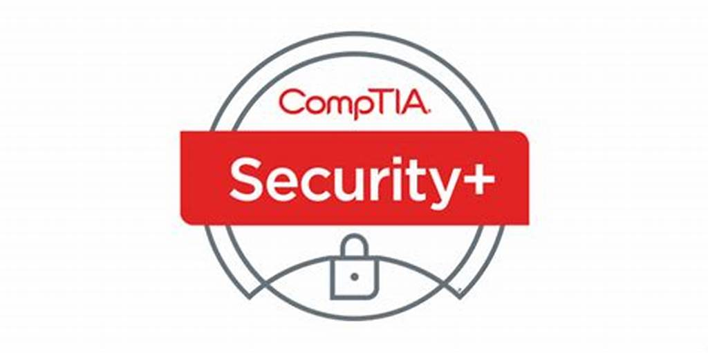

<h1>
<h1>👨‍🎓 Tajai Jones </h1>
<h2><strong>Technology Enthusiast (Developer/IT-Professional/Lifelong Learner)</strong><h2>

 Hi, I'm Tajai! I am currently a Cybersecurity student looking to turn my passion of information security into a profession! 
    On this page you will find various projects I am working on to expand my knowledge base on IT Security. Enjoy your stay!

</h1>

<h2>🏆 Certifications </h2>

  
   
   

<h2> 🧰 Languages and Tools </h2>

  
  
  
   
   

  
<h2>👨‍💻 IT Projects:</h2>

  - [Active Directory Homelab](https://github.com/TJD48/LABURL)

<h2>📝 Write Ups:</h2>
  <ul>
    <li><a href="hackthissite.org_Writeups">Hackthissite.org</a></li>
  </ul>
<h2> 🤳 Connect with me!:</h2>

[][linkedin]

[linkedin]: https://www.linkedin.com/in/tajai-jones-2b24b1204/

<!---
Here are some ideas to get you started:

- 🔭 I’m currently working on ...
- 🌱 I’m currently learning ...
- 👯 I’m looking to collaborate on ...
- 🤔 I’m looking for help with ...
- 💬 Ask me about ...
- 📫 How to reach me: ...
- 😄 Pronouns: ...
- ⚡ Fun fact: ...
-->
